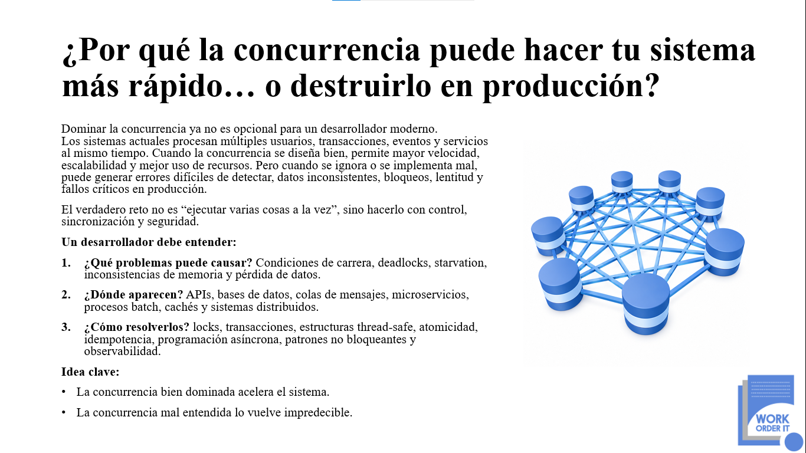

  

# ¿Por qué la concurrencia puede hacer tu sistema más rápido… o destruirlo en producción?

## Concurrencia en Python 3.13: más velocidad o más caos, depende de cómo la diseñes

Este repositorio presenta un caso práctico sobre concurrencia en **Python 3.13**, enfocado en demostrar cómo la ejecución concurrente puede mejorar el rendimiento de un sistema, pero también puede provocar errores graves cuando el estado compartido no se controla correctamente.

Dominar la concurrencia ya no es opcional para un desarrollador moderno. Los sistemas actuales procesan múltiples usuarios, transacciones, eventos y servicios al mismo tiempo. Cuando la concurrencia se diseña bien, permite mayor velocidad, escalabilidad y mejor uso de recursos. Cuando se ignora o se implementa mal, puede generar errores difíciles de detectar, datos inconsistentes, bloqueos, lentitud y fallos críticos en producción.

El verdadero reto no es ejecutar varias tareas al mismo tiempo, sino hacerlo con control, sincronización y seguridad.

---

## Objetivo del repositorio

Explicar, mediante un ejemplo práctico en **Python 3.13**, cómo un sistema puede procesar órdenes en paralelo para mejorar su rendimiento, pero terminar generando resultados incorrectos si varios hilos modifican el mismo estado compartido sin coordinación.

El repositorio también muestra cómo corregir este problema utilizando mecanismos de sincronización que protegen únicamente la actualización del dato compartido, conservando el beneficio del procesamiento concurrente sin comprometer la exactitud de los resultados.

---

## Tecnología principal

- Lenguaje: Python
- Versión utilizada: Python 3.13
- Enfoque: Concurrencia, estado compartido, condiciones de carrera y sincronización entre hilos
- Módulos utilizados: `threading` y `time`
- Tipo de proyecto: Ejemplo técnico y educativo para desarrolladores

---

## Problema que se analiza

El caso presentado simula un sistema que procesa múltiples órdenes de manera concurrente. La intención es reducir el tiempo total de procesamiento mediante la ejecución de varias tareas al mismo tiempo.

El sistema acumula dos datos importantes:

- Cantidad de órdenes procesadas.
- Monto total acumulado.

El problema aparece cuando varios hilos intentan leer, calcular y escribir esos valores al mismo tiempo sin ningún mecanismo de protección.

Aunque el sistema parezca estar procesando las órdenes correctamente, el resultado final puede ser incorrecto porque algunas actualizaciones pueden perderse.

---

## Riesgo principal

El sistema puede parecer rápido y funcional, pero los datos finales pueden quedar corruptos.

Este tipo de error es especialmente peligroso porque puede no generar una excepción visible. La aplicación puede terminar su ejecución normalmente, pero entregar resultados inconsistentes.

En un entorno de producción, esto puede provocar:

- Menos operaciones registradas de las realmente procesadas.
- Montos acumulados incorrectos.
- Pérdida silenciosa de actualizaciones.
- Inconsistencias difíciles de detectar.
- Errores intermitentes y difíciles de reproducir.
- Falsa sensación de rendimiento.
- Riesgo operativo para procesos críticos del negocio.

---

## Conceptos clave que aborda el repositorio

Este proyecto ayuda a comprender conceptos esenciales de concurrencia en Python 3.13, tales como:

- Condiciones de carrera.
- Estado compartido.
- Pérdida de actualizaciones.
- Lectura, cálculo y escritura no protegida.
- Sincronización entre hilos.
- Uso de locks.
- Seguridad en secciones críticas.
- Confiabilidad en sistemas concurrentes.

---

## Dónde suelen aparecer estos problemas

Los errores de concurrencia pueden aparecer en muchos escenarios reales, incluyendo:

- APIs con múltiples solicitudes simultáneas.
- Procesamiento de transacciones.
- Sistemas de órdenes.
- Procesos batch.
- Microservicios.
- Colas de mensajes.
- Cachés compartidas.
- Sistemas distribuidos.
- Servicios que procesan eventos en paralelo.

---

## Enfoque de la solución

La solución conserva la ejecución concurrente, pero protege la sección crítica donde se modifica el estado compartido.

En lugar de permitir que varios hilos actualicen al mismo tiempo los valores acumulados, se utiliza un mecanismo de bloqueo para asegurar que solo un hilo pueda leer, calcular y escribir esos valores en un momento determinado.

Esto permite que el sistema mantenga la ventaja de procesar órdenes en paralelo, pero evita que los resultados finales se corrompan.

---

## Aprendizaje principal

La concurrencia no se trata simplemente de ejecutar muchas tareas al mismo tiempo.

Se trata de paralelizar sin perder control sobre los datos compartidos.

Una concurrencia bien diseñada puede acelerar el sistema.

Una concurrencia mal entendida puede volverlo impredecible.

---

## Idea clave

La concurrencia bien dominada acelera el sistema.

La concurrencia mal diseñada puede destruir la confiabilidad de una aplicación en producción.

---

## Público objetivo

Este repositorio está dirigido a:

- Desarrolladores Python.
- Desarrolladores backend.
- Arquitectos de software.
- Equipos técnicos que trabajan con sistemas transaccionales.
- Profesionales que desean comprender riesgos reales de concurrencia.
- Estudiantes que desean aprender concurrencia desde un caso práctico.

---

## Resultado esperado

Al revisar este proyecto, el desarrollador podrá entender por qué un sistema concurrente puede ser más rápido, pero también más riesgoso si no se controla correctamente el acceso al estado compartido.

El objetivo no es solo demostrar un error técnico, sino reforzar una lección fundamental para producción:

La velocidad sin control puede convertirse en inconsistencia.

---

## Autor

**Work Order IT**  
Soluciones tecnológicas, arquitectura de software y formación técnica para equipos de desarrollo.

Este repositorio forma parte de una iniciativa educativa orientada a explicar cómo la concurrencia en **Python 3.13** puede acelerar un sistema o volverlo impredecible cuando el estado compartido no se controla correctamente.

Website: [www.workorder-it.net](https://www.workorder-it.net)
